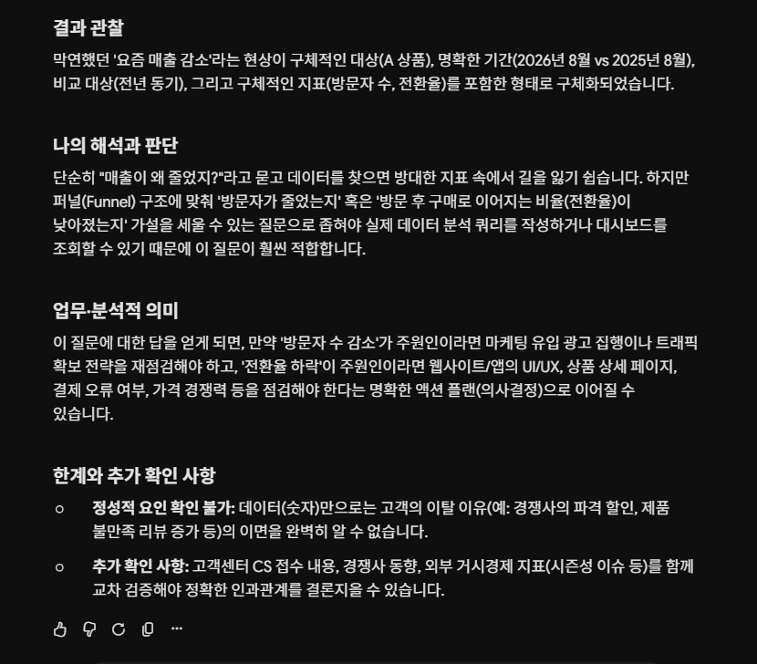
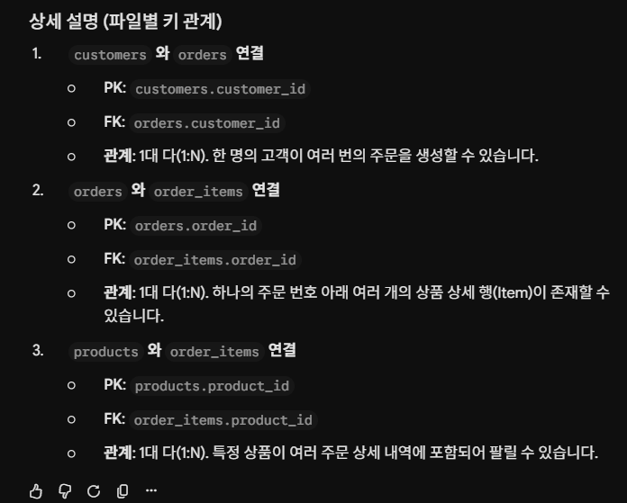
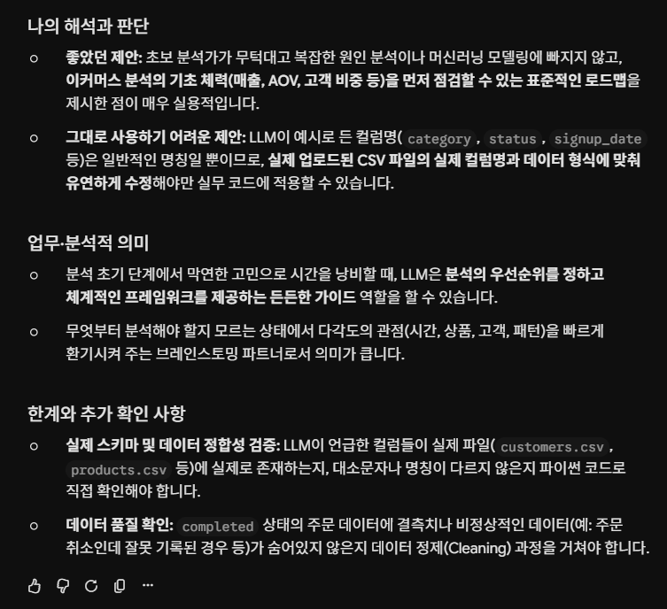
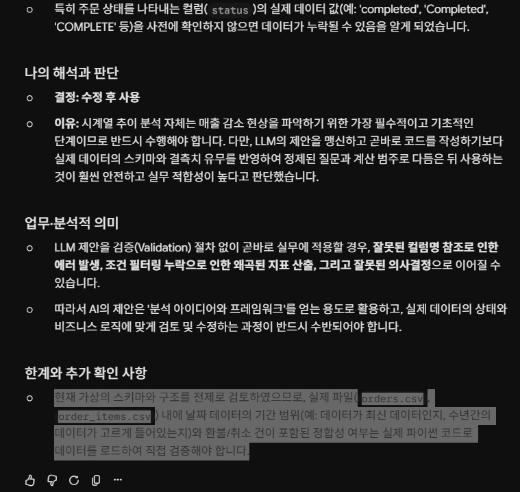
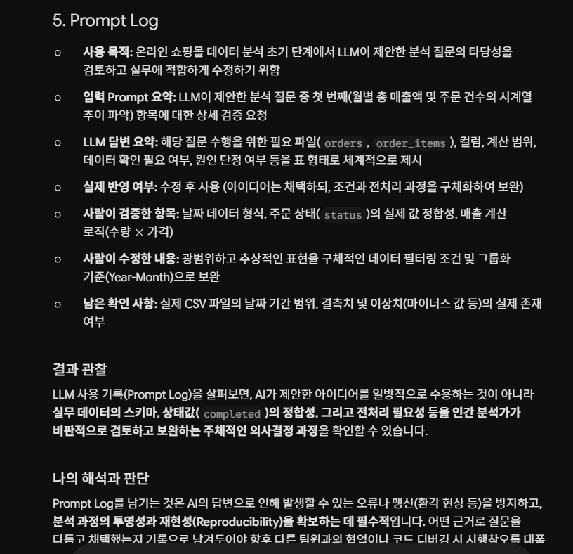
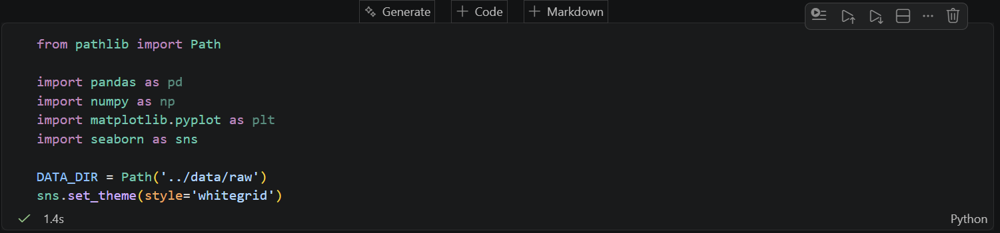

# Chapter 01 제출 답안. AI와 함께하는 데이터 분석의 시작

> 이 파일은 Chapter 01 실습 결과를 정리하여 제출하기 위한 학생용 템플릿입니다.  
> 강사 저장소의 원본 템플릿을 직접 수정하지 말고, 자신의 PC에 복사한 뒤 작성합니다.

---

## 0. 제출 정보

- 이름:김종복
- GitHub ID:koreajjangboy
- 개인 저장소명: `llm-data-analysis-study`
- 작성일:2026-09-03
- 사용한 LLM:

### 최종 제출 URL

```text
https://github.com/koreajjangboy/llm-data-analysis-study/blob/a53bee12225b510762fdff13e121fa09932a5a36/chapter01/chpater01.md
```

---

## 1. 원래 업무 질문

### 내가 선택한 막연한 질문

```text
요즘 매출이 줄어든 것 같은데 왜 그런가요?
```

### 왜 이 질문이 모호하다고 생각했는가?

- 대상:'매출'과 '줄어든 것 같은' 현상의 주체가 전체 회사인지, 특정 상품인지, 특정 채널인지 범위가 명확하지 않습니다.
- 기간:'요즘'이라는 시기가 최근 1주일인지, 지난달인지, 작년 동기 대비인지 기준이 모호합니다.
- 기준:매출이 줄었다고 판단하는 절대적인 수치나 목표 기준이 없습니다.
- 비교 방법:무엇과 비교해서 줄었다고 판단하는지(전주, 전월, 전년 동기 등) 대상이 빠져 있습니다.
- 분석 목적:단순 원인 파악인지, 마케팅 전략 수정인지, 비용 절감 대책 수립인지 목적이 불분명합니다.

### 분석 가능한 질문으로 다시 작성

```text
당사 주요 제품군인 A 상품의 지난달(2026년 8월) 온라인 채널 매출이 전년 동기(2025년 8월) 대비 15% 감소한 원인을 파악하기 위해, 신규 방문자 수 감소와 장바구니 전환율 하락 중 어느 요인의 영향이 더 컸는지 비교 분석해주세요.
```

### 결과 관찰

막연했던 '요즘 매출 감소'라는 현상이 구체적인 대상(A 상품), 명확한 기간(2026년 8월 vs 2025년 8월), 비교 대상(전년 동기), 그리고 구체적인 지표(방문자 수, 전환율)를 포함한 형태로 구체화되었습니다.

### 나의 해석과 판단

단순히 "매출이 왜 줄었지?"라고 묻고 데이터를 찾으면 방대한 지표 속에서 길을 잃기 쉽습니다. 하지만 퍼널(Funnel) 구조에 맞춰 '방문자가 줄었는지' 혹은 '방문 후 구매로 이어지는 비율(전환율)이 낮아졌는지' 가설을 세울 수 있는 질문으로 좁혀야 실제 데이터 분석 쿼리를 작성하거나 대시보드를 조회할 수 있기 때문에 이 질문이 훨씬 적합합니다.

### 업무·분석적 의미

이 질문에 대한 답을 얻게 되면, 만약 '방문자 수 감소'가 주원인이라면 마케팅 유입 광고 집행이나 트래픽 확보 전략을 재점검해야 하고, '전환율 하락'이 주원인이라면 웹사이트/앱의 UI/UX, 상품 상세 페이지, 결제 오류 여부, 가격 경쟁력 등을 점검해야 한다는 명확한 액션 플랜(의사결정)으로 이어질 수 있습니다.

### 한계와 추가 확인 사항

정성적 요인 확인 불가: 데이터(숫자)만으로는 고객의 이탈 이유(예: 경쟁사의 파격 할인, 제품 불만족 리뷰 증가 등)의 이면을 완벽히 알 수 없습니다.

추가 확인 사항: 고객센터 CS 접수 내용, 경쟁사 동향, 외부 거시경제 지표(시즌성 이슈 등)를 함께 교차 검증해야 정확한 인과관계를 결론지을 수 있습니다.

### Evidence



---

## 2. 질문과 필요한 데이터 연결

### 필요한 데이터 파일

- [x] `customers.csv`
- [x] `products.csv`
- [x] `orders.csv`
- [x] `order_items.csv`

### 필요한 컬럼 후보

| 파일 | 필요한 컬럼 | 필요한 이유 |
| --- | --- | --- |
| orders.csv | order_id, customer_id, order_date, status | 주문 발생 시점과 주문 상태(취소/완료 등)를 파악하여 기간별 매출 및 구매 건수를 집계하기 위해 필요합니다. |
| order_items.csv | order_item_id, order_id, product_id, quantity, price | 어떤 상품이 몇 개 팔렸고, 총 얼마의 매출이 발생했는지(수량 × 가격) 상세 거래 내역을 계산하기 위해 필요합니다. |
| products.csv | product_id, product_name, category, unit_price | 상품별 카테고리 정보와 상품명을 매핑하여 카테고리별 매출 증감 추이를 비교하기 위해 필요합니다. |
| customers.csv | customer_id, signup_date, region | 고객의 가입 시기나 지역별 특성에 따른 매출 변화(예: 신규 고객 유입 감소 여부)를 분석하기 위해 필요합니다. |

### 데이터 연결 관계

```text
customers 와 orders 연결

PK: customers.customer_id

FK: orders.customer_id

관계: 1대 다(1:N). 한 명의 고객이 여러 번의 주문을 생성할 수 있습니다.

orders 와 order_items 연결

PK: orders.order_id

FK: order_items.order_id

관계: 1대 다(1:N). 하나의 주문 번호 아래 여러 개의 상품 상세 행(Item)이 존재할 수 있습니다.

products 와 order_items 연결

PK: products.product_id

FK: order_items.product_id

관계: 1대 다(1:N). 특정 상품이 여러 주문 상세 내역에 포함되어 팔릴 수 있습니다.
```

### 결과 관찰

"매출 감소의 원인이 무엇인가?"라는 막연한 질문에 답하기 위해서는 단일 테이블의 데이터만으로는 부족하며, 주문(주기/일자)과 상세 내역(수량/가격), 그리고 상품(카테고리) 및 고객 정보를 모두 결합(Join)해야만 시간 흐름에 따른 카테고리별/고객군별 매출 변동 추이를 입체적으로 추적할 수 있다는 사실을 확인했습니다.

### 나의 해석과 판단

현재 제공된 데이터 구조(customers, orders, order_items, products)는 이커머스나 리테일 분석에서 가장 전형적인 스타 스키마(Star Schema) 형태를 띠고 있습니다. 따라서 데이터 간의 Primary Key(PK)와 Foreign Key(FK) 관계를 명확히 이해하고 조인한다면, 매출 감소가 특정 카테고리의 판매량 급감 때문인지, 아니면 객단가 하락이나 신규 고객 유입 감소 때문인지 충분히 정량적으로 증명할 수 있다고 판단합니다.

### 업무·분석적 의미

질문과 데이터 구조를 먼저 연결(Data-Question Alignment)하는 작업은 분석의 방향성을 잃지 않고 불필요한 데이터 탐색 시간을 줄이는 데 핵심적인 역할을 합니다. 어떤 컬럼이 필요한지 먼저 정의해야 쿼리나 파이썬 코드를 작성할 때 데이터 유실(무분별한 Inner Join으로 인한 데이터 누락 등)을 방지하고, 경영진이나 실무 부서가 수용할 수 있는 신뢰도 높은 분석 결과를 도출할 수 있습니다.

### 한계와 추가 확인 사항

데이터 실제 상태 확인: 각 파일의 컬럼명과 데이터 타입(예: 날짜형 포맷 여부, 금액의 숫자형 변환 필요성), 결측치(Null)나 이상치(마이너스 금액, 잘못된 주문 상태 등)가 존재하는지 실제 데이터프레임 조회를 통해 확인해야 합니다.

정성적 데이터의 부재: 시스템 데이터상 매출 수치와 감소 추이는 파악할 수 있으나, 고객이 왜 이탈했는지(경쟁사 프로모션, 서비스 불만 등)에 대한 정성적 맥락은 본 데이터만으로는 알 수 없으므로 추가적인 설문조사나 CS 데이터 결합이 필요할 수 있습니다.

### Evidence




---

## 3. LLM에게 분석 질문 후보 요청

### 사용 목적

```text
분석 질문에 대한 후보를 요청하기 위해
```

### 사용한 Prompt

```text

온라인 쇼핑몰 데이터 분석을 준비하고 있습니다.

데이터는 다음 4개 파일로 구성됩니다.

- customers: 고객 정보

- products: 상품 정보

- orders: 주문 정보

- order_items: 주문 상세 정보

목적은 completed 주문 기준 금액과 구매 패턴을 이해하는 것입니다.

초보 데이터 분석자가 먼저 확인할 분석 질문 5개를 제안해 주세요.

각 질문마다 필요한 데이터 파일과 확인할 컬럼 후보도 적어 주세요.

원인을 단정하지 말고, 현재 데이터로 확인 가능한 질문 중심으로 제안해 주세요.
```

### LLM 답변 요약

LLM의 전체 답변을 그대로 복사하지 말고 핵심 제안 3~5개를 요약하세요.

1.전체 매출 및 주문 건수의 시계열 추이 (월별/연도별)
2.주요 상품 카테고리별 매출 기여도 및 비중
3.고객의 평균 주문 금액(AOV, Average Order Value) 및 구매 빈도 분석
4.신규 고객 대 기존 고객의 매출 비중 및 기여도
5.요일별·시간대별 주문 패턴 분석

### 결과 관찰

현상 중심의 접근: LLM이 제안한 질문들은 "왜 매출이 줄었는가?"라는 단정적이고 모호한 원인 추적 대신, 시계열 추이, 카테고리별 비중, 고객 세그먼트, 구매 패턴 등 객관적인 현상을 파악하는 탐색적 분석(EDA)에 집중되어 있습니다.

### 나의 해석과 판단

좋았던 제안: 초보 분석가가 무턱대고 복잡한 원인 분석이나 머신러닝 모델링에 빠지지 않고, 이커머스 분석의 기초 체력(매출, AOV, 고객 비중 등)을 먼저 점검할 수 있는 표준적인 로드맵을 제시한 점이 매우 실용적입니다.

그대로 사용하기 어려운 제안: LLM이 예시로 든 컬럼명(category, status, signup_date 등)은 일반적인 명칭일 뿐이므로, 실제 업로드된 CSV 파일의 실제 컬럼명과 데이터 형식에 맞춰 유연하게 수정해야만 실무 코드에 적용할 수 있습니다.

### 업무·분석적 의미

분석 초기 단계에서 막연한 고민으로 시간을 낭비할 때, LLM은 분석의 우선순위를 정하고 체계적인 프레임워크를 제공하는 든든한 가이드 역할을 할 수 있습니다.

### 한계와 추가 확인 사항

실제 스키마 및 데이터 정합성 검증: LLM이 언급한 컬럼들이 실제 파일(customers.csv, products.csv 등)에 실제로 존재하는지, 대소문자나 명칭이 다르지 않은지 파이썬 코드로 직접 확인해야 합니다.

### Evidence



---

## 4. LLM 제안 검증

LLM 제안 중 하나 이상을 선택해 검토합니다.

| 검증 항목 | 확인 내용 |
| --- | --- |
| 선택한 LLM 제안 | "최근 기간 동안 completed 상태인 주문의 월별 총 매출액과 주문 건수는 어떻게 변화해 왔는가?" |
| 필요한 파일 | orders.csv, order_items.csv |
| 필요한 컬럼 | orders: order_id, order_date, statusorder_items: order_id, quantity, price (또는 매출 관련 수치) |
| 계산 범위 | 전체 기간 중 주문 상태(status)가 completed인 행들만을 대상으로 필터링한 뒤, 월별(Year-Month)로 그룹화하여 주문 건수(Count)와 총 매출액(수량 $\times$ 가격의 합계)을 집계 |
| 실제 데이터 확인 필요 여부 | 필요함. order_date의 데이터 타입이 날짜형(Datetime)인지 문자열인지 확인 필요하며, 금액 계산을 위해 price와 quantity 컬럼에 결측치나 이상치(마이너스 값 등)가 없는지 검증해야 함 |
| 원인 단정 여부 | 원인 단정 아님. 매출이 왜 줄었거나 늘었는지에 대한 주관적 원인을 추정하는 것이 아니라, 시계열 흐름에 따른 객관적인 현상(팩트) 자체를 먼저 관찰하는 목적임 |
| 최종 판단 | 수정 후 사용 |

### 내가 수정한 내용

```text
단순히 월별 매출과 주문 건수를 보는 것뿐만 아니라, orders 테이블의 status 컬럼 값이 정확히 대소문자나 공백 없이 completed로 필터링되는지 확인하는 전처리 단계를 명시하고, 매출액은 order_items의 quantity와 price를 곱한 후 order_id 기준으로 합산(Aggregation)하도록 계산 방식을 구체적으로 수정했습니다.
```

### 결과 관찰

검증 과정에서 LLM이 제안한 질문은 분석의 방향성을 잡는 데 훌륭한 나침반 역할을 하지만, 실제 데이터(orders, order_items)에 어떤 컬럼이 존재하는지(예: 날짜 형식이 문자열인지, 타임스탬프인지)에 따라 쿼리나 파이썬 코드 구현 방식이 달라진다는 점을 확인했습니다.

### 나의 해석과 판단

시계열 추이 분석 자체는 매출 감소 현상을 파악하기 위한 가장 필수적이고 기초적인 단계이므로 반드시 수행해야 합니다. 다만, LLM의 제안을 맹신하고 곧바로 코드를 작성하기보다 실제 데이터의 스키마와 결측치 유무를 반영하여 정제된 질문과 계산 범주로 다듬은 뒤 사용하는 것이 훨씬 안전하고 실무 적합성이 높다고 판단했습니다.

### 업무·분석적 의미

LLM 제안을 검증(Validation) 절차 없이 곧바로 실무에 적용할 경우, 잘못된 컬럼명 참조로 인한 에러 발생, 조건 필터링 누락으로 인한 왜곡된 지표 산출, 그리고 잘못된 의사결정으로 이어질 수 있습니다.

### 한계와 추가 확인 사항

현재 가상의 스키마와 구조를 전제로 검토하였으므로, 실제 파일(orders.csv, order_items.csv) 내에 날짜 데이터의 기간 범위(예: 데이터가 최신 데이터인지, 수년간의 데이터가 고르게 들어있는지)와 환불/취소 건이 포함된 정합성 여부는 실제 파이썬 코드로 데이터를 로드하여 직접 검증해야 합니다.

### Evidence



---

## 5. Prompt Log

- 사용 목적:온라인 쇼핑몰 데이터 분석 초기 단계에서 LLM이 제안한 분석 질문의 타당성을 검토하고 실무에 적합하게 수정하기 위함
- 입력 Prompt 요약:LLM이 제안한 분석 질문 중 첫 번째(월별 총 매출액 및 주문 건수의 시계열 추이 파악) 항목에 대한 상세 검증 요청
- LLM 답변 요약:해당 질문 수행을 위한 필요 파일(orders, order_items), 컬럼, 계산 범위, 데이터 확인 필요 여부, 원인 단정 여부 등을 표 형태로 체계적으로 제시
- 실제 반영 여부:수정 후 사용 (아이디어는 채택하되, 조건과 전처리 과정을 구체화하여 보완)
- 사람이 검증한 항목:날짜 데이터 형식, 주문 상태(status)의 실제 값 정합성, 매출 계산 로직(수량 $\times$ 가격)
- 사람이 수정한 내용:광범위하고 추상적인 표현을 구체적인 데이터 필터링 조건 및 그룹화 기준(Year-Month)으로 보완
- 남은 확인 사항:실제 CSV 파일의 날짜 기간 범위, 결측치 및 이상치(마이너스 값 등)의 실제 존재 여부

### 결과 관찰

LLM 사용 기록(Prompt Log)을 살펴보면, AI가 제안한 아이디어를 일방적으로 수용하는 것이 아니라 실무 데이터의 스키마, 상태값(completed)의 정합성, 그리고 전처리 필요성 등을 인간 분석가가 비판적으로 검토하고 보완하는 주체적인 의사결정 과정을 확인할 수 있습니다.

### 나의 해석과 판단

Prompt Log를 남기는 것은 AI의 답변으로 인해 발생할 수 있는 오류나 맹신(환각 현상 등)을 방지하고, 분석 과정의 투명성과 재현성(Reproducibility)을 확보하는 데 필수적입니다. 어떤 근거로 질문을 다듬고 채택했는지 기록으로 남겨두어야 향후 다른 팀원과의 협업이나 코드 디버깅 시 시행착오를 대폭 줄일 수 있습니다.

### Evidence



---

## 6. 개인정보와 Secret 보호 확인

다음 항목을 확인합니다.

- [x] 실제 이름·이메일·전화번호 등 고객 개인정보를 Prompt에 사용하지 않았습니다.
- [x] API Key를 코드나 Notebook에 직접 작성하지 않았습니다.
- [x] `.env` 실제 내용을 캡처하거나 업로드하지 않았습니다.
- [x] GitHub Token, 비밀번호, 내부 URL이 캡처에 보이지 않습니다.
- [x] 제출 전 이미지까지 다시 확인했습니다.

### 나의 판단

민감한 개인정보

---

## 7. Chapter 01 Notebook 확인

Notebook:

```text
notebooks/ch01_ai_data_analysis_intro.ipynb
```

### 내 환경 상태

- [ ] 아직 환경설정 전이라 Notebook 위치만 확인했습니다.
- [x] 환경설정이 완료되어 Notebook을 직접 실행했습니다.

### 환경설정 완료 학생만 작성

#### 실행한 코드

```python
from pathlib import Path

import pandas as pd
import numpy as np
import matplotlib.pyplot as plt
import seaborn as sns

DATA_DIR = Path('../data/raw')
sns.set_theme(style='whitegrid')
```

#### 실행 결과

```text
오류 없이 실행
```

#### 결과 관찰

내용이 없습니다.

#### 나의 해석과 판단

현재 Notebook은 곧바로 복잡한 데이터 분석을 시작하는 본래의 단계가 아니라, 분석을 수행하기 전 필요한 도구와 환경을 미리 세팅해 두는 '스타터 스캐폴드(Starter Scaffold, 기본 뼈대)'의 역할을 합니다. 마치 요리를 시작하기 전에 칼과 도마를 정돈하고 재료를 손질할 준비를 마친 상태와 같습니다.

#### 한계와 추가 확인 사항

단지 환경 설정 코드만으로는 실제 데이터의 형태나 상태를 알 수 없습니다.

#### Evidence



> 환경설정 전이라면 이 이미지는 생략할 수 있습니다.

---

## 8. Chapter 01 최종 해석

### 이번 장에서 가장 중요하다고 생각한 내용

```text
LLM의 제안을 맹신하지 않고, 실제 데이터의 상태와 정합성을 비판적으로 검토하는 프롬프트 로그(Prompt Log) 작성과 검증 프로세스의 중요성을 이해했습니다.
```

### LLM을 데이터 분석에 사용할 때 가장 조심해야 할 점

```text
LLM이 그럴듯하게 제시하는 컬럼명이나 분석 로직이 실제 보유한 데이터의 구조와 정확히 일치하는지 반드시 검증해야 한다는 점입니다. 만약 검증 없이 코드를 사용하면 존재하지 않는 필드를 참조하거나 왜곡된 결과를 도출할 수 있으므로, AI는 아이디어를 얻는 도구로만 한정하고 최종 판단은 분석가가 주도해야 합니다.
```

### 사람과 LLM의 역할 차이

| 항목 | LLM이 도울 수 있는 부분 | 사람이 책임져야 하는 부분 |
| --- | --- | --- |
| 질문 정의 | 분석 관점 다각화, 브레인스토밍 및 가설 아이디어 제공 | 비즈니스 맥락에 맞는 최종 분석 질문 선정 및 구체화 |
| 데이터 확인 | 데이터 구조 설명, 스키마 분석 코드 초안 작성 | 실제 데이터 파일의 결측치, 이상치, 타입 및 정합성 검증 |
| 코드 작성 | 판다스(Pandas) 및 시각화 라이브러리 활용 쿼리·코드 생성 | 코드 실행 결과의 오류 디버깅 및 실무 환경에 맞게 수정 |
| 결과 해석 | 수치 변화에 대한 통계적 해석 및 시각화 아이디어 제안 | 비즈니스 의사결정에 미치는 영향 평가 및 맥락 해석 |
| 최종 판단 | 분석 단계별 선택지 요약 및 장단점 정리 | 분석 결과 채택 여부 결정 및 후속 액션 플랜 수립 |

### 다음 Chapter에서 확인하고 싶은 것

```text
Chapter 02~03에서는 앞서 세팅한 DATA_DIR 환경을 활용해 실제로 4개의 CSV 파일(customers, products, orders, order_items)을 불러와 어떻게 조인(Join)하고 전처리하는지 그 구체적인 코드를 확인하고 싶습니다.
```

---

## 9. 최종 제출 체크리스트

- [x] 원래 업무 질문과 구체화한 분석 질문을 작성했습니다.
- [x] 질문에 필요한 데이터 파일과 컬럼 후보를 정리했습니다.
- [x] LLM Prompt와 답변 요약을 작성했습니다.
- [x] LLM 제안을 실제 데이터 관점에서 검증했습니다.
- [x] 각 핵심 STEP의 결과 관찰을 작성했습니다.
- [x] 각 핵심 STEP의 나의 해석과 판단을 작성했습니다.
- [x] 업무·분석적 의미를 작성했습니다.
- [x] 한계와 추가 확인 사항을 작성했습니다.
- [x] 핵심 실행 Evidence 이미지를 첨부했습니다.
- [x] 이미지가 Markdown에서 정상 표시됩니다.
- [x] 개인정보가 없습니다.
- [x] API Key·Secret·Token이 없습니다.
- [x] 개인 GitHub 저장소에 업로드했습니다.
- [x] GitHub에서 Markdown과 이미지가 정상 표시됩니다.
- [x] 아래 최종 파일 URL이 정상적으로 열립니다.

### 최종 파일 URL

```text
https://github.com/koreajjangboy/llm-data-analysis-study/blob/d0827fac50d8c9bbdc7273b8d3f46ab8dbf3c0e6/chapter01/chpater01.md
```

---

## 10. 교수자 확인용 요약

### 수행 상태

- [x] COMPLETE
- [ ] PARTIAL

### 내가 가장 중요하게 내린 판단 1개

```text
LLM의 제안을 맹신하지 않고, 실제 데이터의 상태와 정합성을 비판적으로 검토하는 프롬프트 로그(Prompt Log) 작성과 검증 프로세스의 중요성을 이해했습니다.
```

### 아직 확인이 필요한 내용 1개

```text
-
```